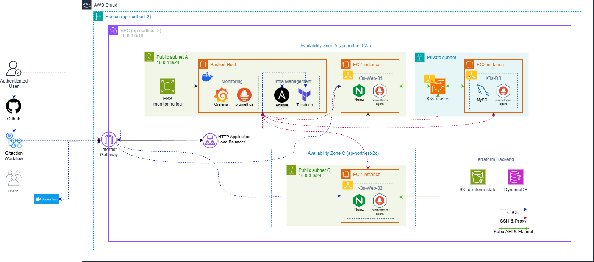
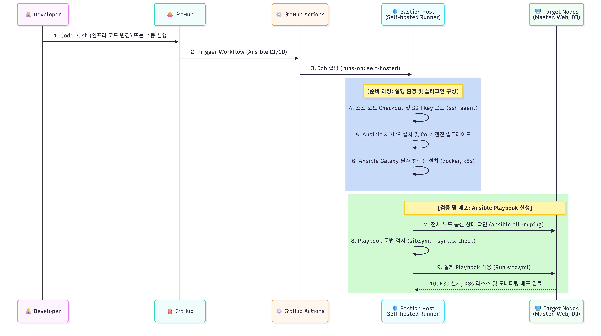
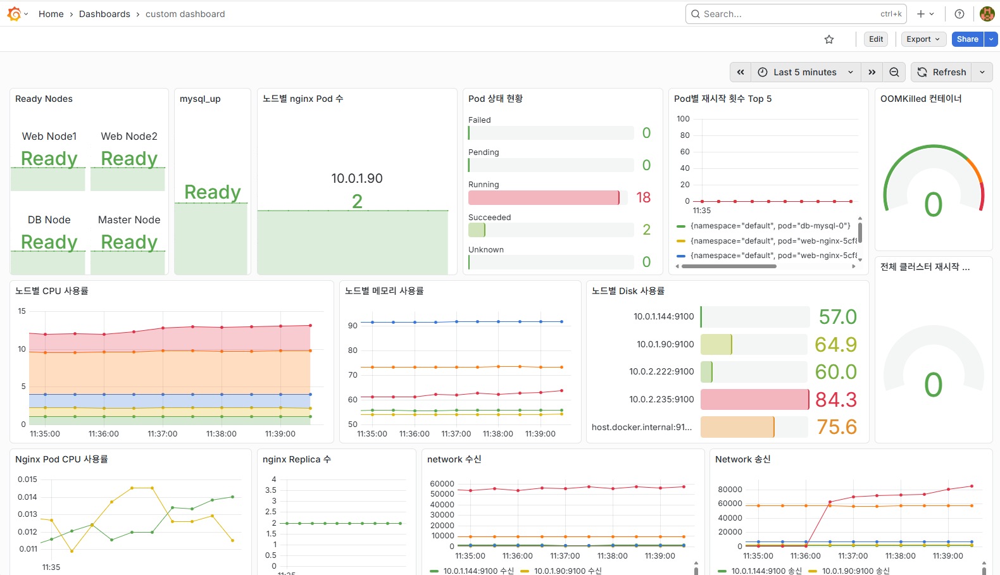
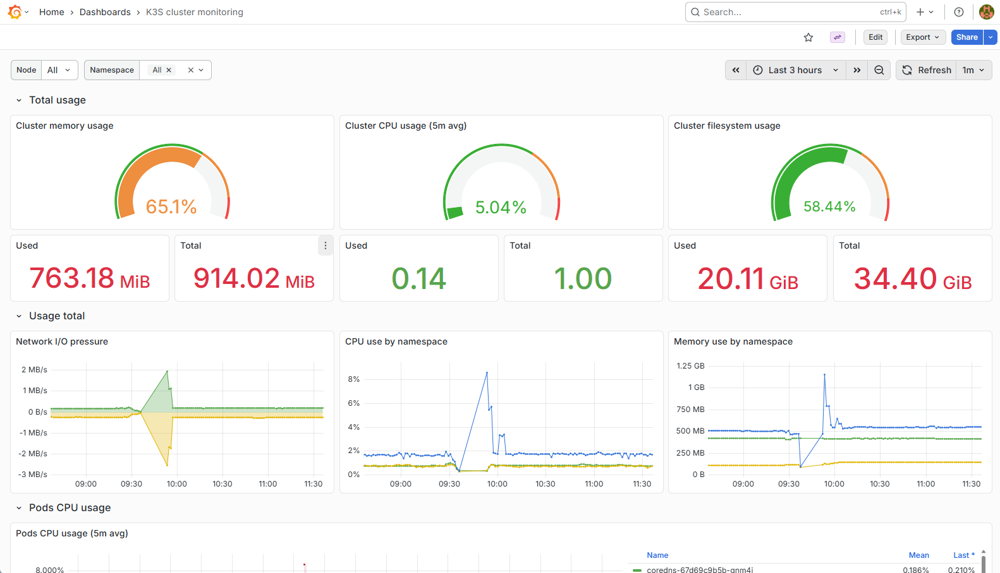
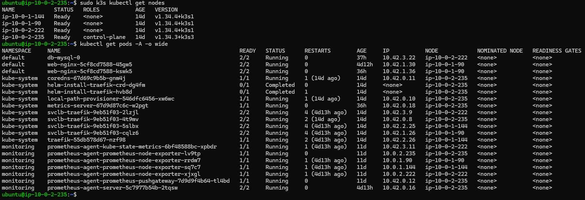

# AWS K3s Cluster Automation with Ansible

Ansible을 활용하여 AWS 환경의 Kubernetes(K3s) 클러스터 구성, 애플리케이션 배포, 모니터링 환경 구축을 자동화한 팀 프로젝트입니다.

## Architecture



본 프로젝트는 Terraform으로 생성된 AWS 인프라를 기반으로, Ansible을 통해 K3s Master/Worker 노드를 구성하고 웹 애플리케이션, 데이터베이스, 모니터링 스택을 자동 배포합니다.

---

## Overview

AWS 클라우드 환경에서 K3s 기반 Kubernetes 클러스터를 자동 구성하고, GitHub Actions 기반 CI/CD와 Prometheus/Grafana 모니터링 환경을 함께 구축하는 것을 목표로 합니다.

Bastion Host를 통해 Private Subnet 내부 노드를 제어하며, Ansible Playbook과 Role을 활용하여 Docker 설치, K3s 클러스터 구성, Kubernetes Manifest 적용, 모니터링 스택 배포를 자동화했습니다.

---

## Key Features

### K3s Cluster Automation

* K3s Master Node 자동 설치
* Worker Node 자동 Join
* Node Label 자동 적용
* 클러스터 상태 검증 자동화

### Application Deployment

* Nginx Web Application 배포
* MySQL Database 배포
* Kubernetes Manifest 기반 서비스 구성
* Ingress 기반 트래픽 라우팅

### CI/CD Automation

* GitHub Actions 기반 Ansible 자동 실행
* Docker Image Build & Push
* Kubernetes 배포 자동화
* Bastion Host 기반 Private Node 제어

### Monitoring

* Prometheus Agent 기반 메트릭 수집
* Grafana Dashboard 구성
* Discord Webhook 기반 알림 설정
* 중앙 집중형 모니터링 환경 구축

---

## Workflow

1. Terraform으로 AWS 인프라 생성
2. Ansible Dynamic Inventory로 대상 노드 조회
3. Bastion Host를 경유하여 Private Node 접속
4. Docker 및 K3s 설치
5. Master / Worker 클러스터 구성
6. Kubernetes Manifest 적용
7. Prometheus & Grafana 모니터링 배포
8. GitHub Actions를 통한 자동화 실행

---

## Ansible CI/CD Pipeline



GitHub Actions와 Self-hosted Runner를 활용하여 Ansible Playbook 실행을 자동화하였습니다.

코드 변경 시 Workflow가 실행되며 Bastion Host에 구성된 Self-hosted Runner가 Playbook을 수행하여 K3s 클러스터 구성, Kubernetes 리소스 배포 및 모니터링 환경 구축을 자동으로 수행합니다.

---

## Monitoring Stack

### Service Monitoring Dashboard



Grafana Dashboard를 통해 Kubernetes 서비스 및 애플리케이션 상태를 실시간으로 모니터링할 수 있도록 구성하였습니다.

* Node 상태 모니터링
* MySQL 서비스 상태 확인
* Pod 상태 및 재시작 횟수 모니터링
* Nginx Replica 상태 확인
* Network 송수신 모니터링

### Kubernetes Cluster Monitoring



Prometheus를 통해 수집한 메트릭을 기반으로 Kubernetes 클러스터 리소스 사용량을 시각화하였습니다.

* Cluster CPU Usage
* Cluster Memory Usage
* Cluster Filesystem Usage
* Namespace Resource Usage
* Pod Resource Usage
* Network I/O Monitoring

---

## Tech Stack

| Category                 | Technology                |
| ------------------------ | ------------------------- |
| Configuration Management | Ansible                   |
| Container Platform       | Docker, Kubernetes(K3s)   |
| CI/CD                    | GitHub Actions            |
| Application              | Nginx, MySQL              |
| Monitoring               | Prometheus, Grafana       |
| Cloud                    | AWS EC2, VPC, ALB         |
| Inventory                | AWS EC2 Dynamic Inventory |

---

## Repository Structure

```text
.
├── .github
│   └── workflows
│       ├── ansible.yml
│       └── ci.yml
│
├── app
│   ├── Dockerfile
│   └── index.html
│
├── inventory
│   ├── aws_ec2.yml
│   ├── static.ini
│   └── group_vars
│
├── k8s
│   ├── mysql-db.yaml
│   ├── nginx-ingress.yaml
│   └── nginx-web.yaml
│
├── playbooks
│   ├── cd.yml
│   ├── k3s.yml
│   ├── k8s_apply.yml
│   ├── monitoring.yml
│   └── site.yml
│
├── roles
│   ├── docker
│   ├── helm
│   ├── k3s_master
│   ├── k3s_worker
│   ├── k8s_deploy
│   ├── monitoring_stack
│   └── prometheus_agent
│
├── docs
│   ├── architecture.png
│   ├── ansible-cicd-flow.png
│   ├── cluster-verification.png
│   ├── service-monitoring-dashboard.png
│   └── cluster-monitoring-dashboard.png
│
└── README.md
```

---

## Main Playbooks

| Playbook                   | Description             |
| -------------------------- | ----------------------- |
| `playbooks/site.yml`       | 전체 자동화 실행               |
| `playbooks/k3s.yml`        | K3s 클러스터 구성             |
| `playbooks/k8s_apply.yml`  | Kubernetes Manifest 적용  |
| `playbooks/monitoring.yml` | Prometheus / Grafana 배포 |
| `playbooks/cd.yml`         | 애플리케이션 배포 자동화           |

---

## Cluster Verification



K3s Master 및 Worker Node가 정상적으로 클러스터에 Join 되었으며, 애플리케이션 및 모니터링 리소스가 정상 배포된 것을 확인하였습니다.

* Control Plane(Node Master) 구성 완료
* Worker Node 3대 정상 Join
* Nginx Web Application 배포 완료
* MySQL Database 배포 완료
* Prometheus Agent 및 Node Exporter 배포 완료
* Grafana Monitoring Stack 연동 완료

클러스터 검증은 다음 명령어를 통해 수행하였습니다.

```bash
sudo k3s kubectl get nodes

kubectl get pods -A -o wide
```

---

## Results

* AWS 기반 K3s 클러스터 구축 완료
* Ansible 기반 자동 프로비저닝 및 클러스터 구성 자동화
* GitHub Actions Self-hosted Runner 기반 CI/CD 구축
* Nginx Web 및 MySQL Database 배포 완료
* Prometheus & Grafana 기반 모니터링 환경 구축
* Bastion Host 기반 Private Network 운영 환경 구성
* Ansible 기반 클러스터 운영 자동화 구현

---
